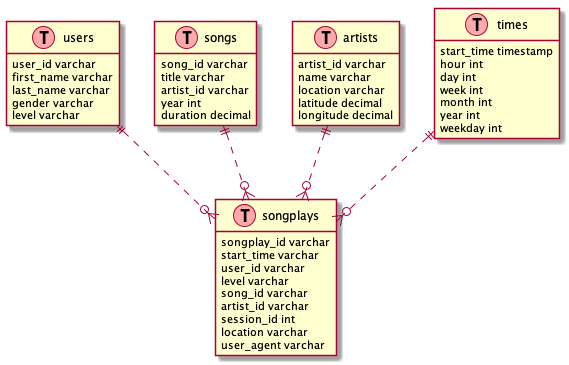

# ETL project for Sparkify
Sparkify provides a musing streaming platform for their users, and there are log files of this service which displays users' activity details. Users' activity details show when a user logs in to the system and which songs and artists are preferred.

 ## Goals
- To provide a structured storage of existing log files which allows to query activities of users and information about users themselves and songs.
- Enriching log data while structuring by using song data on [Million Song Dataset](http://millionsongdataset.com/)
- Using the song and log datasets, creating a star schema optimized for queries on song play analysis.

## Data Model
Data model will include 5 tables, all tables named with plural words.
`songplays` table is the fact table and `users`, `songs`, `artist`, `times` are the dimension tables.

